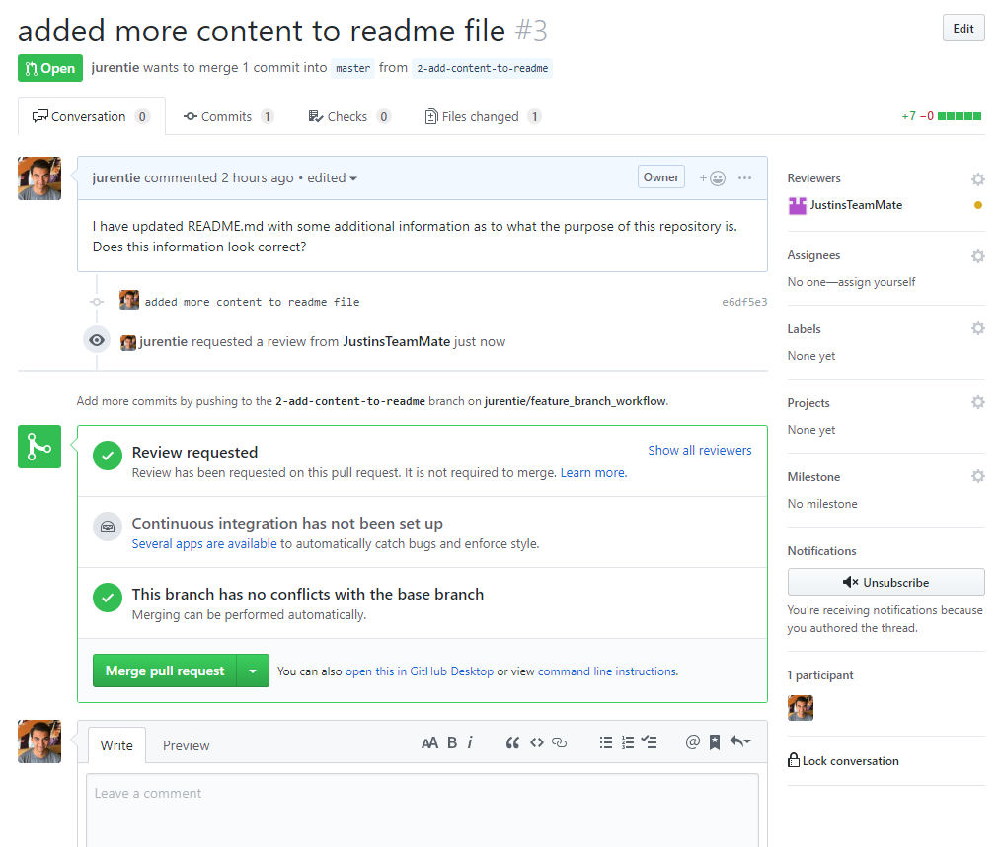
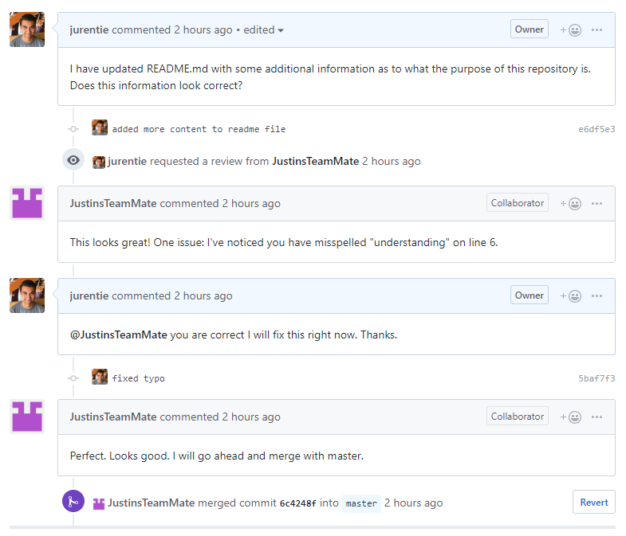

## Table of Contents ##

* [Introduction](#introduction)
* [Feature Branch Workflow](#feature-branch---single-developer)
* [Pull Requests](#pull-requests---multiple-developers)
* [Forking a Repository](#forking-a-repository---open-source)
* [Fast-Forward](#fast-forward)
* [References](#references)

## Introduction ##

At work I have been tasked with learning the various git workflows a developer may
have when contributing to code. Whether this be a single developer on a project, a
team of developers collaborating on a large project, or a single user who is part of
the open source community and would like to help contribute to someone else's
project.

I have been all over the internet learning as much as I can about the technicalities
involved in different approaches in a git contributors workflow. Along the way I
have been documenting many of the things I have learned both for work and to publish
on my site as future reference for myself, and to help others that might take an
interest in learning more about git.

Below you will find information and examples on the details of different approaches
to git.

## Feature Branch - Single Developer ##

When using the feature branch workflow it is easy to keep track of exactly what code
is being added or removed from the overall project. Edits should be made in small
incremental stages using separate feature branches. This makes it easier to go back in
history and find exactly what code was added to make changes to the project.

All development that takes place is done in feature branches and never in `master`.
This way master will never have any broken code.

It is good practice to use feature branches in all of the workflows described
throughout this post.

#### How it works: ####
The following is an example of using a feature branch to do development on a single
project.

1. Following best practices, begin by creating an issue on GitHub that describes what feature is
being added to the code.


2. Before making the feature branch, ensure you are on the master branch,
and that `master` is up to date with any recent changes.
```
$ git checkout master
$ git pull
```

3. Create a feature branch (sometimes referred
to as a "topic" branch) from `master`. You want to be as precise and detailed as
possible in naming the new branch. Here I am using the issue number and label, which
seems to be common practice.  
```
$ git checkout -b 1-update-readme
```
`checkout` *switches to a new branch,* `-b` *creates
the new branch if the given branch name does not already exist.  
The figure below represents a new branch being created off of* `master`.
<p align="center">
 
</p>

4. Once in the new feature branch, edit, stage, and commit changes to this branch in
exactly the same manner used when editing code on `master`.
```
$ git status
$ git add README.md
$ git commit -m "updated README.md"
```

5. After testing the feature to ensure no issues,
it is safe to merge `1-update-readme` with `master`. (In a larger team of developers
it would be best to have someone approve any changes made, perhaps with [pull
requests](#pull-requests) discussed below.) To merge, switch back to `master`, ensure that
`master` is up to date, and merge `1-update-readme` with `master` branch.
```
$ git checkout master
$ git pull
$ git merge --no-ff 1-update-readme
$ git push
```

Below is an example of what a non-fast-forwarded feature branch looks like when
merged with master, taken from the network chart on GitHub.
<p align="center">
  
</p>

By default git will try to merge a branch using **fast-forward** mode. It is best
practice to use **no-fast-forward** with the following flag `--no-ff`. See [below](#fast-forward) for more information
on **fast-forward** versus **no-fast-forward**.

## Pull Requests - Multiple Developers ##

Pull requests are good to use in larger teams of developers, or in situations where
it is necessary to ensure another person's code is working properly. For example, if several
developers are working on a very important, or a very large project, it is best to
make sure that any changes made to this repository will not break the code. Pull
requests are also a good way for one developer to notify the rest of the team that
they have completed development on a single feature.

Pull requests are an extension of feature branches. Instead of allowing a single
trusted developer to merge their branch without review, they must receive permission
from other members of the team before doing so.

> You can open a Pull Request at any point during the development process: when you have little or no code but want to share some screenshots or general ideas, when you're stuck and need help or advice, or when you're ready for someone to review your work. By using GitHub's @mention system in your Pull Request message, you can ask for feedback from specific people or teams, whether they're down the hall or ten time zones away.

In the following example, every developer on the team will have write permission
therefore no fork is needed. [Forking a repository](#forking-a-repository---open-source) is
covered below.

#### How it works: ####

Begin by following the same steps above (1-4) for creating a new feature branch to develop
on. See [above](#feature-branch---single-developer) for more detail. The feature branch in the following example is `2-add-content-to-readme`, and once again the example is adding
more information to the README.md file.

After making edits in a feature branch, instead of allowing a single developer to
merge the edits with `master`, it is safer to create a pull request. To do this,
the feature branch must be pushed to remote. Below is an example of creating a
pull request.

5. Push branch to remote
```
$ git push -u origin 2-add-content-to-readme
```
*This command pushes* `2-add-content-to-readme` *to the central repository (origin),*
`-u` *flag adds it as a remote tracking branch, so any future edits can be pushed via*
`$ git push` *without as many flags and parameters.*  
Now that the new branch is pushed to remote it can be seen on GitHub's web interface
such as below.


6. Create a pull request by clicking "Compare & pull request". This will open a
new page with options to add a label and comments to the pull request as well as
assign reviewers to check the code. At the top there is a status bar that shows
whether or not the edits made in this pull request have any merge conflicts
with `master`. After creating the pull request there will be another page that
clearly shows if there are any merge conflicts present, as well as a big green
"Merge pull request" button, provided there are no issues, as seen below.


7. Other developers are able to comment on the pull request and, upon review, any
new commits pushed to the remote branch will appear in a linear fashion, between
comments on the pull request.


8. Once everything looks good, someone with write permission can merge the pull
request by clicking "Merge pull request"

Below is an example of what a merged pull request looks like, taken from the network
chart on GitHub.

<p align="center">
 
</p>

By default git will merge the pull request using `--no-ff` (**no-fast-forward**). See
[below](#fast-forward) to learn more about fast forward.

## Forking a Repository - Open Source ##

Once a project is made public other developers in the open source community may
want to make changes to the repository, but do not have write permissions to the project.
Users with no write permission can propose changes by forking the repository.
Forking is a unique way of making a copy of a repository and saving it
on your personal GitHub profile. Sometimes forking can be used as a way to take someone else's project and begin your own.

#### How it works: ####

1. First navigate to the public repository where contributions will be made to the code,
and click "Fork" in the upper right hand corner.
<p align="center">
  
</p>
This repository will now be forked and a personal copy will be made to the users
personal GitHub account. This will be reflected in the repository title.
<p align="center">
  
</p>

2. The repository will now need to be cloned locally, in order to make any changes
to the project.
```
$ git clone https://github.com/JustinsTeamMate/feature_branch_workflow.git
```

3. Edit, stage, and commit changes to the forked repository.
```
$ git status
$ git add README.md
$ git commit -m "updated README.md"
```

4. Push changes to remote repository.
```
$ git push
```
After pushing to remote GitHub will show that the personal repository is ahead of
the original repository.
<p align="center">
  
</p>

5. Click "Pull request". From here the process of contributing to a public repository is the same as the section above on [pull requests](#pull-requests---multiple-developers). See above
for more detail.

Below is an example of what the current state of the repository looks like after
merging edits using 1) feature branch 2) pull requests 3) forking a repository. It
is clean to look at and clear to understand where each edit was made.

<p align="center">
  
</p>

All of the merges in the diagram above were made using **no-fast-forward** option.
See [below](#fast-forward) for more information.

## Fast-Forward ##

#### Feature Branches: ####

When merging a feature branch, by default git will try to merge using **fast-forward** mode.
```
$ git merge feature-branch
```

When **fast-forward** is applied to a merge, git will merge the commits in a *linear*
fashion. The history will look like the diagram on the right below.

To force git to merge with no fast forward use the parameter `--no-ff`:

```
$ git merge --no-ff feature-branch
```

With **no-fast-forward**, git will maintain the feature branch in the
history and create a new commit on `master` representing the merge with that
feature branch, as well as representing the commits from that branch separate from
`master`. This can be seen represented by the diagram on the left below.

<p align="center">
  
</p>

It is possible to configure git to automatically use `--no-ff` specifically for a
given branch.

```
$ git config branch.master.mergeoptions "--no-ff"
```

#### Pull Requests: ####

When working with pull requests on GitHub's web interface via the green
"Merge pull request" button, the default behavior is to use no fast-forward.

<p align="center">
  
</p>

GitHub behaves this way to ensure that pull requests can be identified later on.
However, it is possible to merge a pull request with fast forward for pull requests
with squashed or rebased commits.

## References ##
* [About pull requests](https://help.github.com/articles/about-pull-requests/)
* [Can I make fast forwarding be off by default in git?](https://stackoverflow.com/questions/2500296/can-i-make-fast-forwarding-be-off-by-default-in-git)
* [Forking Projects](https://guides.github.com/activities/forking/)
* [Fast-Forward Git Merge](https://ariya.io/2013/09/fast-forward-git-merge)
* [Git Feature Branch Workflow](https://www.atlassian.com/git/tutorials/comparing-workflows/feature-branch-workflow)
* [Merging a pull request](https://help.github.com/articles/merging-a-pull-request/)
